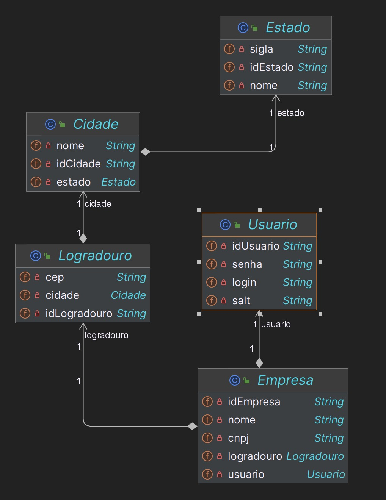

# Administrador de usuários

## Integrantes
- Luiza Nunes de Jesus - Banco de dados
- Melissa de Oliveira Pecoraro - IA
- Pamella Schimalesky Engholm - Dotnet e QA
- Pedro Marques Pais Pavão  - Devops
- Roberto Menezes dos Santos - Java e mobile


## Getting Started

Primeiro faça o download do projeto:
```
git clone https://github.com/RobertSDM/adm-usuarios
```

Após o download abra a pasta no seu IDE preferido, aqui iremos continuar com o *IntelliJ*

Espere todas as dependencias serem baixadas. \
Com todas as depêndencias baixadas, adicione os dados para se conectar ao banco de dados MySQL no caminho:
```
/src/main/resources/application.properties
```

Agora com todas as configurações necessarias feitas, basta rodar o projeto.

## UML das entidades




## Video descrevendo projeto

# Documentação API

### Pricipais rotas
1. [Empresa](#empresa)
2. [Usuario](#usuario)
3. [Logradouro](#logradouro)
4. [Cidade](#cidade)
5. [Estado](#estado)

## <a id="empresa"></a>Empresa

`GET`

#### /find/all

#### /find/{id}

`POST`

#### /create

`PUT`

#### /update/{id}

`DELETE`

#### /delete/{id}

## <a id="usuario"></a>Usuario

`GET`

#### /find/all

#### /find/{id}

`PUT`

#### /update/all/{id}

#### /update/password/{id}

#### /update/login/{id}

`DELETE`

#### /delete/{id}

## <a id="logradouro"></a>Logradouro

`GET`

#### /find/all

#### /find/{id}

`PUT`

#### /update/{id}

`DELETE`

#### /delete/{id}

## <a id="cidade"></a>Cidade

`GET`

#### /find/all

#### /find/{id}

`PUT`

#### /update/{id}

`DELETE`

#### /delete/{id}

## <a id="estado"></a>Estado

`GET`

#### /find/all

#### /find/{id}

`PUT`

#### /update/{id}

`DELETE`

#### /delete/{id}
